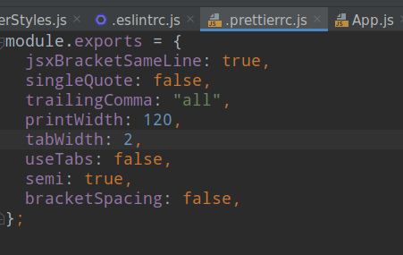
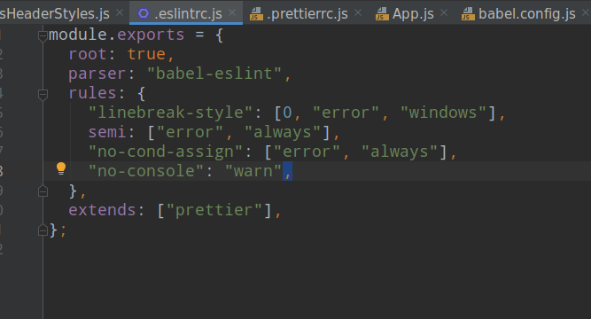
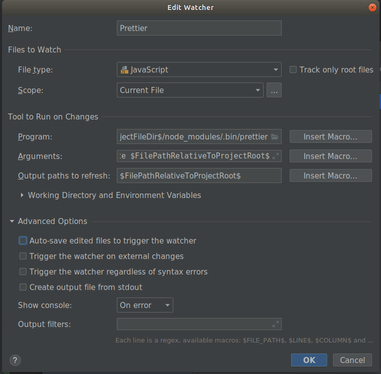
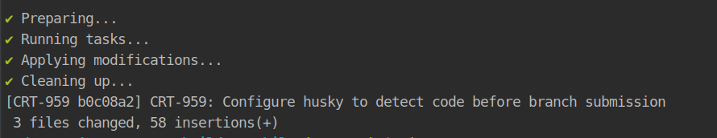
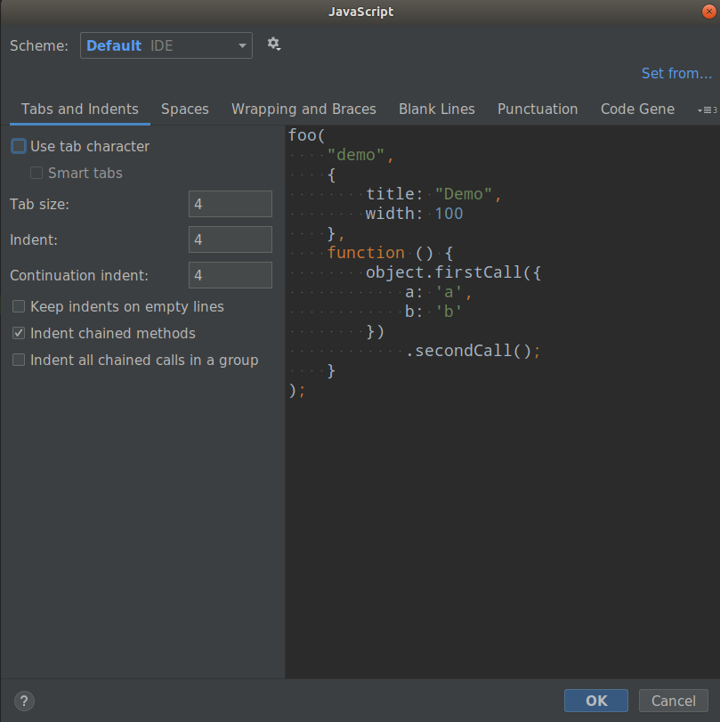

# Remind App


## running the app locally

The app uses webpack development server to allow you to view your changes in real time.

**1. install dependencies**

`yarn install`

**2. run the iOS app**

`yarn ios`

**3. run the Android app**

`yarn android`


## Code Quality

### Prettier

Prettier supports many languages and integrates with most code editors. It will auto-magically formats your code!

#### How to use it?

#### Installation

Prettier and related dependencies can be installed by running

#### npm

`npm i -D prettier eslint-plugin-prettier eslint-config-prettier`

#### yarn

`yarn add -D prettier eslint-plugin-prettier eslint-config-prettier`

#### Configuration

Create .prettierrc files at root directory for any prettier rules (semicolons, quotes, etc).



Then, in .eslintrc.js file, add related content as shown:



#### Run in terminal

`yarn prettier --write {file name or directory name}`

#### Run Prettier on save

Go to Preferences or Settings -> Tools -> File Watchers and click + to add a new watcher according to the following configuration:



Uncheck 'Auto-save edited files to trigger the watcher'.

P.S. Program should be the installation path of prettier under node_modules.

Then it will run Prettier on current file save.


### Husky

Husky can detect code before branch submission

#### How to use it?

#### Installation

#### npm

`npm install --save-dev husky`

#### configure in package.json file

````
{
    "husky": {
        "hooks": {
        "pre-commit": "lint-staged"
    }
}
````

#### Lint-staged

Only deal with the files changed in this submission

#### Installation

`npm install --save-dev lint-staged`

#### configure in package.json file

````
{
    "lint-staged": {
        "*.{js,jsx}": [
            "eslint --fix",
        ]
    }
}
````

After husky executed you will see:




## Specification

### Editor

#### vscode, phycharm, webstorm

We should set tabs and indents of JavaScript file consistently, the value should be 4.

Editor of JetBrains please refer to this image:



### Code

1. Avoid string: avoid using too much string in one file, try your best to extract them into `Constants.js` file which used to contain constants and
   pay attention to the name of each constant, the format should like this `EDUCATION_TITLE`.

2. **Variable name:** the first letter should in lower case and the total name should be camel case, the name can be a little longer, but the meaning must be clear, for example: `tipsModalVisible`

3. **File Name:**

    - Screen files: camel case, capitalize first letter (`EditSuammry.js`)
    - Styles files: same as screen files (`EditSummaryStyles.js`)
    - Util files: camel case, first letter in lower case (`adapterUtils.js`)
    - JSON files: same as util files (`school.json`)
    - Function files: same as util files (`getResumes.js`)

4. Type of file:
   some small components without complex logic and necessary of too much changes of state, we should use function component instead of class component.

5. Tags: please use single closed tags instead of empty tags

6. Spelling: please check the spelling again and again, and eslint must enabled it will detect automatically

7. Import and log: remove all unused imports and logs before push your pull request

8. Styles: write styles in style files as you can, except styles need complex judgements

9. State and props: when you need to use multiple state or prop please write in this way: `const {name, age} = this.state/props`

10. SetState(): when you need to set multiple state in one function, please write together

11. Ternary operator: if you just need to judge one time, please select ternary operator, otherwise consider `if/else` `switch`, don't nest ternary operator!

12. Function body: one function should be concise, if too much code inside, please simplify it, extract some code into another function

13. `findIndex()` and `indexOf()`: if you just want to judge one element whether exist, `findIndex()` should be first, if you want to get `index`, please use `indexOf()`

14. Judgement: we should use strict mode, please use `===` `!==`

15. Use es6 syntax first: use `const` and `let` instead of `var`, `() => {}` instead of `function() {}`

16. Common components: please check whether already have similar components existed before work on new ticket, use it if exist, otherwise, please
    think about it whether will be used in other files, if so, please extract it into `component` directory and try your best to make it readable and reusable

17. Code line: the number of lines of code in a js file should be controlled within 250 lines, you can extract your code into multiple small files if UI is complex
